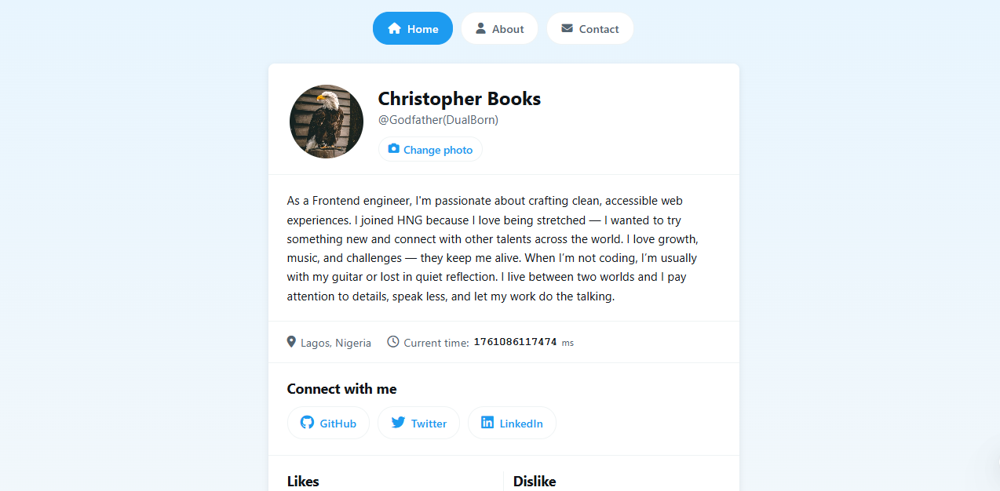

# Portfolio Website - HNG Stage 0 & 1

My submission for the HNG13 Frontend Stage 0 together with stage 0. A multi-page portfolio website building on my Stage 0 profile card.

<p align="center">
  
</p>

## Live Demo

🔗 **[View Live Site](https://profile-card-hng-stage-0-task.netlify.app/)**

---

## What's New in Stage 1

Added two new pages to my existing profile card:
- **Contact page** with form validation
- **About page** with personal reflections
- **Navigation buttons** to move between pages

---

## Pages

### 1. Home (index.html)
My profile card from Stage 0 with added navigation. Shows who I am, what I do, and how to connect with me.

### 2. Contact (contact.html)
A contact form where you can send me a message. Features:
- Full name, email, subject, and message fields
- Real-time validation as you fill it out
- Email format checking
- Message minimum 10 characters
- Clear error messages for each field
- Success message after submission

### 3. About (about.html)
Personal reflections about my journey:
- Who I am and why I code
- My goals in HNG
- Areas where I'm still learning
- A note to my future self
- Extra thoughts on development

---

## How to Run

1. Clone this repository
   ```bash
   git clone https://github.com/DualBorn/Profile-Card-HNG-Stage-0-Task
   cd Profile-Card-HNG-Stage-0-Task
   ```

2. Open `index.html` in your browser
3. Use the navigation buttons to explore all pages

No installation needed. No dependencies. Just clone and open.

---

## File Structure

├── index.html       - Homepage with profile card
├── contact.html     - Contact form page
├── about.html       - About me page
├── styles.css       - All styles (Stage 0 + Stage 1)
├── script.js        - Profile card functionality
└── README.md        - This file

---

## Features

✅ **Multi-page navigation** - Easy navigation between pages  
✅ **Form validation** - Real-time error checking  
✅ **Semantic HTML** - Proper tags throughout  
✅ **Fully accessible** - Keyboard navigation, ARIA labels, screen reader friendly  
✅ **Mobile responsive** - Works on all devices  
✅ **Test-ready** - All required `data-testid` attributes  
✅ **Consistent design** - Same look and feel across all pages  

---

## Form Validation Rules

The contact form checks:
- **Name**: Required, can't be empty
- **Email**: Required, must be valid format (name@example.com)
- **Subject**: Required, can't be empty
- **Message**: Required, minimum 10 characters

Errors show up when you leave a field. Form won't submit until everything is valid.

---

## Browser Support

Works on:
- Chrome, Edge, Firefox, Safari
- All modern mobile browsers

---

## Built With

- Plain HTML5
- Plain CSS3 (Flexbox & Grid)
- Vanilla JavaScript
- Font Awesome icons

---

## Stage 1 Requirements Met

### Contact Page
- All required fields with correct `data-testid` attributes
- Validation prevents invalid submissions
- Success message only shows after valid submission
- All inputs have labels linked with `for`
- Error messages tied to inputs with `aria-describedby`
- 100% keyboard accessible

### About Page
- All required sections with correct `data-testid` attributes
- Semantic HTML (main, section, headings)
- Proper heading hierarchy
- Accessible structure

### General
- Semantic HTML throughout
- Accessible design
- Fully responsive
- Keyboard navigable
- Clean, readable code
- Consistent with Stage 0 design

---

## What I Learned

Building Stage 1 taught me:
- Form validation beyond basic HTML5 attributes
- Managing accessibility across multiple pages
- Real-time error handling and user feedback
- Keeping design consistent across pages

---

## Author

**Godfather (DualBorn)**  
- GitHub: [@DualBorn](https://github.com/DualBorn)
- X (Formerly Twitter): [@DualBorn](https://x.com/DualBorn)

---

Made for [HNG Internship](https://hng.tech/internship) Stage 0